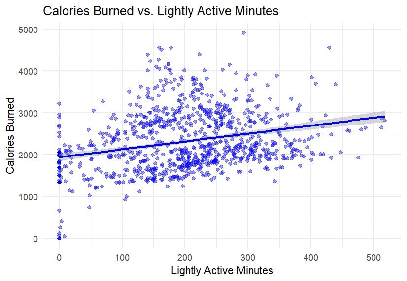

# Bellabeat Case Study with R

Welcome to my first data analytics project! This repo dives into the Bellabeat Time wellness watch, exploring how people use smart devices to help Bellabeat improve their marketing and products.

# Acknowledgments

Before diving into the analysis, I would like to extend my gratitude to those whose work has greatly inspired me during this project:

- Zhenxiong Yang, whose detailed case study is available on [Kaggle](https://www.kaggle.com/code/zhenxiongyang/google-data-analytics-bellabeat-case-study).
- Anastasia Chebotina, for her insightful analysis also found on [Kaggle](https://www.kaggle.com/code/chebotinaa/bellabeat-case-study-with-r/notebook).
- Victor Ukegbu, whose thoughtful reflections can be read on [Medium](https://vicukegbu.medium.com/bellabeat-case-study-912c9aa2b0fa).

Their contributions to the field have provided valuable perspectives and guidance that shaped this project.

### Now, let's proceed to delve into the project! 🚀

#### This case study follows the six-step data analysis process, which ensures a thorough and systematic examination of the data. The steps are: 
#### ❓ [Ask](#step-1-ask), defining the questions and objectives;
#### 💻 [Prepare](#step-2-prepare), where we collect and organize the data;
#### 🛠️ [Process](#step-3-process), focusing on data cleaning and verification;
#### 📊 [Analyze](#step-4-analyze), where we deeply explore the data and draw insights;
#### 📋 [Share](#step-5-share), which involves presenting our findings;
#### 🧗🏻‍♀️ [Act](#step-6-act), where we make recommendations based on our analysis.

# Introduction


Founded in 2013 by Urška Sršen and Sandro Mur, [Bellabeat]( https://bellabeat.com/) is a high-tech company that focuses on creating beautiful, innovative products designed specifically for women. With a strong emphasis on empowering women to take control of their health and wellness, [Bellabeat]( https://bellabeat.com/) integrates smart technology into everyday items that support overall wellbeing.

[Bellabeat]( https://bellabeat.com/)’s mission is to inspire and empower women to understand their health and wellness better through innovative, technology-driven solutions. The company envisions a world where women are equipped with data and insights gained from their daily activities and health routines, enabling them to make informed decisions and improve their lifestyles.

# Step 1: Ask 

## Business task

Sršen asks you to analyze smart device usage data in order to gain insight into how consumers use non-Bellabeat smart devices. She then wants you to select one Bellabeat product (_Time_ = the wellness watch) to apply these insights to in your presentation. 

## Key stakeholders

1. Urška Sršen (Co-founder and Chief Creative Officer): Interested in leveraging data insights to guide Bellabeat's marketing strategy and unlock new growth opportunities.
2. Sando Mur (Co-founder and key member of the executive team): Concerned with the strategic direction of the company and how data analysis can contribute to achieving business goals.
3. Bellabeat marketing analytics team (including the junior data analyst): Responsible for conducting the analysis and providing actionable recommendations based on the findings.
4. Current and potential customers: Will benefit from improved products and services tailored to their needs and preferences, influenced by the insights derived from the analysis.

## Bellabeat products

- Bellabeat app: The Bellabeat app provides users with health data related to their activity, sleep, stress, menstrual cycle, and mindfulness habits. This data can help users better understand their current habits and make healthy decisions. The Bellabeat app connects to their line of smart wellness products.
- Leaf: Bellabeat’s classic wellness tracker can be worn as a bracelet, necklace, or clip. The Leaf tracker connects to the Bellabeat app to track activity, sleep, and stress.
- Time: This wellness watch combines the timeless look of a classic timepiece with smart technology to track user activity, sleep, and stress. The Time watch connects to the Bellabeat app to provide you with insights into your daily wellness.
- Spring: This is a water bottle that tracks daily water intake using smart technology to ensure that you are appropriately hydrated throughout the day. The Spring bottle connects to the Bellabeat app to track your hydration levels.
- Bellabeat membership: Bellabeat also offers a subscription-based membership program for users. Membership gives users 24/7 access to fully personalized guidance on nutrition, activity, sleep, health and beauty, and mindfulness based on their lifestyle and goals

## Key Questions

1. _What are some trends in smart device usage?_
2. _How could these trends apply to Bellabeat customers?_
3. _How could these trends help influence Bellabeat marketing strategy?_

# Step 2: Prepare

## Data description:

- File type: CSV files (there is a total of 18 datasets)
- Data size: 30 samples
- Data format: Long data
- Data duration: 03.12.2016 - 05.12.2016

## Data source:

FitBit Fitness Tracker Data on [Kaggle]( https://www.kaggle.com/datasets/arashnic/fitbit) in 18 CSV files. The data contains smart health data from personal fitness trackers for thirty fitbit users. The data was collected via a survey of personal tracker data, including minute-level output for physical activity, hear rate, and sleep monitoring, through Amazon Mechanical Turk between March 12, 2016 and May 12, 2016.

## Credibility of the data:

ROCCC (Reliable, Original, Comprehensive, Current & Cited) data test model applied in order to determine the credibility and reliability of the dataset:

- Reliable — LOW — Not reliable as it only has 30 respondents.
- Original — LOW — Third party provider (Amazon Mechanical Turk).
- Comprehensive — MEDIUM —Data is within the parameters required for the Bellabeat’s business task.
- Current — LOW — Data was sourced in 2016 (8 years old) and is not relevant.
- Cited — LOW —The third-party dataset was available by Mobius via Kaggle.

## Loading packages

I'm going to install all the necessary packages and their libraries.

```
install.packages("tidyverse")
library(tidyverse)
library(ggplot2)
library(readr)
```

The Skimr package makes summarizing data really easy.

```
install.packages("skimr")
library(skimr)
```

The Janitor package has functions for cleaning data.
```
install.packages("janitor")
library(janitor)
```

```
install.packages("dplyr")
library(dplyr)
```

The HERE package makes referencing files easier.

```
install.packages("here")
library("here")
```

## Importing the datasets

```
activity <- read.csv("dailyActivity_merged.csv")
calories <- read.csv("dailyCalories_merged.csv")
intensities <- read.csv("dailyIntensities_merged.csv")
steps <- read.csv("dailySteps_merged.csv")
sleep <- read.csv("sleepDay_merged.csv")
weight <- read.csv("weightLogInfo_merged.csv")
```
## Checking the datasets

After importing the datasets, I used the following functions to preview the data and ensure they were imported correctly:
- head()
- str()

```
head(activity)
str(activity)
```

```
head(calories)
str(calories)
```

```
head(intensities)
str(intensities)
```

```
head(steps)
str(steps)
```

```
head(sleep)
str(sleep)
```

```
head(weight)
str(weight)
```

## Findings

- Date values are formatted as chr, which needs to be transformed into the correct date/time format.
- Column names are in inconsistent format, which needs to be renamed to make further analysis easier.

# Step 3: Process

## Converting column names and fixing date formats

### activity

```
activity_new <- activity %>%
  rename_with(tolower) %>% # convert column names to lowercase
  mutate(activitydate = as.Date(activitydate, format="%m/%d/%Y")) # fixing date formats
str(activity_new) # preview the result
```

### intensities

```
intensities_new <- intensities %>%
  rename_with(tolower) %>% # convert column names to lowercase
  mutate(activityday = as.Date(activityday, format="%m/%d/%Y")) # fixing date formats
str(intensities_new) # preview the results
```

### calories

```
calories_new <- calories %>%
  rename_with(tolower) %>% # convert column names to lowercase
  mutate(activityday = as.Date(activityday, format="%m/%d/%Y")) # fixing date formats
str(calories_new) # preview the results
```

### steps

```
steps_new <- steps %>%
  rename_with(tolower) %>% # convert column names to lowercase
  mutate(activityday = as.Date(activityday, format="%m/%d/%Y")) # fixing date formats
str(steps_new) # preview the results
```

### sleep

Now, I'm going to do the same thing, but with a different date-time format. The sleep dataset has the column SleepDay with a specific format: "4/12/2016 12:00:00 AM". I'm going to use as.POSIXct() function to parse the data accordingly.
Before I do that, I need to check my locale settings. After that, I will set the locale settings to "en_US.UTF-8".
Then, I will perform a series of tests in order to ensure that as.POSIXct() function works accordingly.

```
Sys.getlocale("LC_TIME")
```

Save the current locale so I can restore it later
```
original_locale <- Sys.getlocale("LC_TIME")
```

Set the locale to US English temporarily
```
Sys.setlocale("LC_TIME", "en_US.UTF-8")
```

Test conversion of a single date-time string
```
test_date <- as.POSIXct("4/12/2016 12:00:00 AM", format="%m/%d/%Y %I:%M:%S %p", tz=Sys.timezone())
print(test_date)
print(format(test_date, "%Y-%m-%d %H:%M:%S"))
```

Test conversion with a different time
```
test_date_noon <- as.POSIXct("4/12/2016 12:00:00 PM", format="%m/%d/%Y %I:%M:%S %p", tz=Sys.timezone())
print(format(test_date_noon, "%Y-%m-%d %H:%M:%S"))
```
Sleep:

```
sleep_new <- sleep %>%
  rename_with(tolower) %>%  # convert column names to lowercase
  mutate(sleepday = as.POSIXct(sleepday, format="%m/%d/%Y %I:%M:%S %p", tz=Sys.timezone())) # fixing date formats
str(sleep_new) # preview the results
```
Print the first few datetime values with explicit formatting just to check everything is ok

```
print(format(sleep_new$sleepday, "%Y-%m-%d %H:%M:%S"))
```

### weight

Now, I need to follow the same steps as those for the sleep dataset.

```
weight_new <- weight %>%
  rename_with(tolower) %>%  # convert column names to lowercase
  mutate(date = as.POSIXct(date, format="%m/%d/%Y %I:%M:%S %p", tz=Sys.timezone())) # fixing date formats
str(weight_new) # preview the results
```

# Step 4: Analyze

Proceeding to the next steps; using n_distinct() function from the dplyr package. This function counts the number of unique values in a vector or column. 

### Exploring the data

```
n_distinct(activity_new$id)
n_distinct(intensities_new$id)
n_distinct(calories_new$id)
n_distinct(steps_new$id)
n_distinct(sleep_new$id)
n_distinct(weight_new$id)
```
Results: This information tells us about the number of participants in each data set. There are 33 participants in the activity, calories and intensities data sets, 24 in the sleep and only 8 in the weight data set. 8 participants is not significant to make any recommendations and conclusions based on this data.

### Next, let’s have a look at summary statistics of the data sets

### activity
```
View(activity_new)

activity_new %>%  
  select(totalsteps,
         totaldistance,
         sedentaryminutes, 
         calories) %>%
  summary()
```
### intensities
```
View(intensities_new)

intensities_new %>% 
  select(sedentaryminutes,
         lightlyactiveminutes,
         veryactiveminutes) %>% 
  summary(intensities_new)
```
### calories
```
View(calories_new)

calories_new %>% 
  select(calories) %>% 
  summary(calories_new)
```
### steps
```
View(steps_new)

steps_new %>% 
  select(steptotal) %>% 
  summary(steps_new)
```

### sleep
```
View(sleep_new)

sleep_new %>% 
  select(totalminutesasleep) %>% 
  summary(sleep_new)
```

### weight
```
View(weight_new)

weight_new %>% 
  select(weightkg,
         bmi) %>% 
  summary(weight_new)
```
### Findings:
- The average total steps is 7638, which is relatively low comparing to the suggested 10000 steps per day by CDC to stay healthy.
- The average sedentary minutes is 991.2 minutes, equivalents 16.52 hours (991.2/60), which should be considerably reduced.
- The average lightlyactiveminutes is 192.8 and it suggests that the participants are mostly lightly active.
- The average for veryactiveminutes is 21.16 which is very low!
- Minutes asleep are at the minimum 58 and maximum 796, with an average of aprox. 420 min (7 hours) - which is good.
- The average BMI is 25.19, which is overweight according to the standards from CDC (BMI ranges 18.5-24.9 is considered healthy). However, under the circumstances that the age and gender of the participants remained unknown, this could be biased.

# Step 5: Share

## Hypotheses:

### 1. High Activity vs. Low Activity Days: On days with a higher number of steps, there will be a noticeable decrease in the number of sedentary minutes.

Removing rows with missing data in the relevant columns

```
activity_new <- activity_new %>%
  filter(!is.na(totalsteps), !is.na(sedentaryminutes))
  ```

Creating a scatter plot with regression line

```
ggplot(activity_new, aes(x = totalsteps, y = sedentaryminutes)) +
  geom_point(alpha = 0.5, color = "blue") +  # points with transparency for better visualization
  geom_smooth(method = "lm", color = "red") +  # linear regression line
  labs(title = "Relationship between Total Steps and Sedentary Minutes",
       x = "Total Steps",
       y = "Sedentary Minutes") +
  theme_minimal()
  ```


Interpretation: 
- Given that the regression line starts higher on the y-axis and extends down as it moves to the right, this indicates a negative correlation. This means that generally, as the number of total steps increases, the sedentary minutes decrease.
- The presence of points above and below the regression line throughout the plot, especially if they're evenly distributed around the line, suggests that while there is a trend (higher steps are associated with fewer sedentary minutes), the relationship might not be very strong.
- Final conclusion of the 1st hypothesis: the downward trend of the regression line supports the hypothesis that more total steps are associated with fewer sedentary minutes. However, the spread of points suggests that steps alone don't fully predict sedentary behavior.

### 2. Impact of Sleep on Activity: Days following more total sleep time will see an increase in total steps taken, assuming well-rested individuals are more active.

Prepare the sleep data to match the next day's activity

```
sleep_new <- sleep_new %>% 
  mutate(sleepday_next = sleepday +1) # create a column for the next day
  ```

Merge the sleep data with activity data

```
combined_data_1 <- merge(activity_new, sleep_new, by.x = c("id", "activitydate"), by.y = c("id", "sleepday_next"))
```

Check the merged data

```
head(combined_data_1)
View(combined_data_1)
```
Remove rows with missing values in the relevant columns

```
combined_data_1 <- combined_data_1 %>%
  filter(!is.na(totalsteps), !is.na(totalminutesasleep))
```

Creating a scatter plot of previous night's sleep vs. next day's total steps

```
ggplot(combined_data_1, aes(x = totalminutesasleep, y = totalsteps)) +
  geom_point(alpha = 0.5) +  # semi-transparent points to handle overplotting
  geom_smooth(method = "lm", color = "blue") +  # adds a linear regression line
  labs(title = "Impact of Sleep on Next Day's Activity",
       x = "Total Sleep Minutes (Previous Night)",
       y = "Total Steps (Next Day)") 
  theme_minimal()
```


Interpretation:
- Because the regression line is nearly horizontal (almost flat), this implies that there is a weak relationship between the total minutes asleep and the total steps taken the next day. A nearly flat line suggests that changes in sleep duration do not significantly influence the number of steps taken.

### 3. Calories Burned and Active Minutes: There is a stronger correlation between calories burned and very active minutes compared to lightly active or sedentarily active minutes.

Plot for Calories Burned vs. Very Active Minutes

```
ggplot(activity_new, aes(x = veryactiveminutes, y = calories)) +  # initiate a ggplot graph, specify data source and aesthetics: x-axis for very active minutes and y-axis for calories
  geom_point(alpha = 0.4, color = "red") +  # add scatter plot points with partial transparency (alpha = 0.4) and red color
  geom_smooth(method = "lm", color = "red") +  # add a linear regression line to the plot to show the trend, colored red
  labs(title = "Calories Burned vs. Very Active Minutes",  # add labels: set the title of the graph
        x = "Very Active Minutes",  # label for the x-axis
        y = "Calories Burned") +  # label for the y-axis
  theme_minimal()  # use a minimal theme for the plot for a clean and modern look
```


Interpretation:
- The upward slope of the regression line indicates a positive correlation between very active minutes and calories burned. This suggests that as the number of very active minutes increases, the number of calories burned also increases.

Plot for Calories Burned vs. Lightly Active Minutes

```
ggplot(activity_new, aes(x = lightlyactiveminutes, y = calories)) +  # initiate a ggplot graph, specify data source and aesthetics: x-axis for lightly active minutes and y-axis for calories
  geom_point(alpha = 0.4, color = "blue") +  # add scatter plot points with partial transparency (alpha = 0.4) and blue color
  geom_smooth(method = "lm", color = "blue") +  # add a linear regression line to the plot to show the trend, colored blue
  labs(title = "Calories Burned vs. Lightly Active Minutes",  # add labels: set the title of the graph
       x = "Lightly Active Minutes",  # label for the x-axis
       y = "Calories Burned") +  # label for the y-axis
  theme_minimal()  # Use a minimal theme for the plot for a clean and modern look
```



Interpretation:
- The near-flat slope of the blue regression line indicates a weak to moderate positive correlation between lightly active minutes and calories burned. This suggests that while there is some relationship where increased lightly active minutes correspond to an increase in calories burned, the relationship is not as strong or direct as with very active minutes.

Plot for Calories Burned vs. Sedentary Minutes

```
ggplot(activity_new, aes(x = sedentaryminutes, y = calories)) +  # initiate a ggplot graph, specify data source and aesthetics: x-axis for sedentary minutes and y-axis for calories
  geom_point(alpha = 0.4, color = "green") +  # add scatter plot points with partial transparency (alpha = 0.4) and green color
  geom_smooth(method = "lm", color = "green") +  # add a linear regression line to the plot to show the trend, colored green
  labs(title = "Calories Burned vs. Sedentary Minutes",  # add labels: set the title of the graph
       x = "Sedentary Minutes",  # label for the x-axis
       y = "Calories Burned") +  # label for the y-axis
  theme_minimal()  # use a minimal theme for the plot for a clean and modern look
```


Interpretation:
- The almost flat or slightly downward slope of the green regression line indicates a weak negative correlation or no significant correlation between sedentary minutes and calories burned. This suggests that increased sedentary time does not lead to higher calorie burn and might slightly decrease it, which aligns with general health guidelines that recommend reducing sedentary time for better metabolic health.

_Interpretation for the whole H3:_

My hypothesis that there is a stronger correlation between calories burned and very active minutes compared to lightly active or sedentarily active minutes is supported by my analysis:
- The most significant increase in calories burned is associated with very active minutes.
- Lightly active minutes show some positive effect but not as pronounced.
- Sedentary minutes do not contribute to calorie burning and may slightly reduce it.

### 4. BMI and Activity Levels: Individuals with a higher BMI will tend to have fewer total steps and more sedentary minutes.

Merge the data frames based on 'id'

```
combined_data_2 <- merge(activity_new, weight_new, by = "id")
head(combined_data_2)
```
Plot for BMI vs. Total Steps

```
ggplot(combined_data_2, aes(x = bmi, y = totalsteps)) +
  geom_point(alpha = 0.5) +
  geom_smooth(method = "lm", color = "blue") +
  labs(title = "BMI vs. Total Steps",
       x = "BMI",
       y = "Total Steps") +
  theme_minimal()
```


Interpretation:
- The downward slope of the regression line clearly suggests a negative correlation between BMI and total steps. This means that as BMI increases, the number of steps taken typically decreases. Starting from around 13,000 steps at the lower end of the BMI scale and decreasing to about 5,000 steps at higher BMI values reflects a significant reduction in physical activity as weight increases.

Plot for BMI vs. Sedentary Minutes

```
ggplot(combined_data_2, aes(x = bmi, y = sedentaryminutes)) +
  geom_point(alpha = 0.5) +
  geom_smooth(method = "lm", color = "red") +
  labs(title = "BMI vs. Sedentary Minutes",
       x = "BMI",
       y = "Sedentary Minutes") +
  theme_minimal()
```


Interpretation:
- The upward slope of the regression line indicates a positive correlation between BMI and sedentary minutes. This suggests that as BMI increases, individuals tend to have more sedentary minutes, aligning with your hypothesis that individuals with higher BMI will be more sedentary.

_The interpretation for the whole H4:_

Both analyses support the hypothesis that "Individuals with a higher BMI will tend to have fewer total steps and more sedentary minutes." The data clearly shows that as BMI increases, physical activity in the form of total steps decreases, while sedentary behavior increases.

# Step 6: Act

## Expanded Summary of Findings and Recommendations

| Hypotheses | Findings | Recommendation |
|----------|----------|----------|
| Hypothesis 1: High Activity vs. Low Activity Days    |There is a noticeable decrease in sedentary minutes on days when users achieve higher step counts.|Promote the Time watch as a daily motivation tool to reduce sedentary behavior, using alerts and goals to encourage more consistent high-activity days.|
|Hypothesis 2: Impact of Sleep on Activity|Days following nights with more total sleep see an increase in activity, suggesting well-rested individuals are more active.|Integrate sleep tracking features more prominently in the Time product, emphasizing the importance of good sleep in achieving fitness goals. Offer insights and tips on improving sleep quality to enhance daily activity.|
|Hypothesis 3: Calories Burned and Active Minutes|There is a stronger correlation between calories burned and very active minutes than with lightly active or sedentary minutes.|Focus marketing messages on the effectiveness of short, intense activity bursts for burning calories, positioning the Time watch as an ideal companion for such activities with features like activity recognition and progress tracking.|
|Hypothesis 4: BMI and Activity Levels |Individuals with higher BMI tend to have fewer total steps and more sedentary minutes, demonstrating a negative correlation between BMI and physical activity.|Target marketing towards individuals looking to manage or reduce their BMI through active lifestyle changes. Also develop features that help track and manage BMI over time, providing users with tangible goals and measurable outcomes.|

### Ideas for Enhancing the Bellabeat App and Time Watch

1.	_Goal Setting and Challenges_: Implement customizable goals and challenges within the app to cater to various fitness levels and health objectives, encouraging daily interaction and engagement.
2.	_Health Insights_: Utilize data to offer personalized health insights and recommendations, such as optimal times for activity based on user's historical data and current sleep patterns.
3.	_Interactive Features_: Introduce interactive features like virtual group workouts or competitions to encourage connectivity and motivation among users.
4.	_Integration with Professional Health Advice_: Provide options for users to connect with health professionals or coaches through the app, enhancing the personal touch and boosting the credibility of health guidance offered.

### Marketing Strategies
- Use the insights from device data to create targeted ad campaigns that highlight user success stories, particularly focusing on improvements in BMI, activity levels, and sleep.
- Leverage social proof by encouraging users to share their achievements on social media directly through the app, increasing brand visibility and user engagement.


